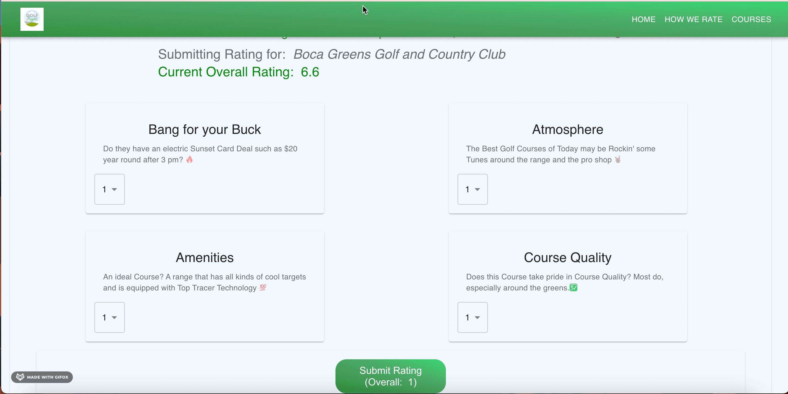

# Golf Right

## A Golf Course Ratings Websites Designed to capture the Golf Coures of Now. Future work looks to verify reviews and provide specific insight with user comments of attribute characteristics.

## Website Link

https://golf-right-1.web.app/

## Tutorial

### Packages installed

    npm install @mui/material @emotion/react @emotion/styled

    npm install @fontsource/roboto

    npm install @mui/icons-material
        import AccessAlarmIcon from '@mui/icons-material/AccessAlarm';
        import ThreeDRotation from '@mui/icons-material/ThreeDRotation';

    npm i react-router-dom

### To Clone

https://github.com/ChristianJWKlein/golf-right-web.git

### Backend

golf-right-api

### To Re-Deploy

npm run build

then from build Folder..

firebase deploy
